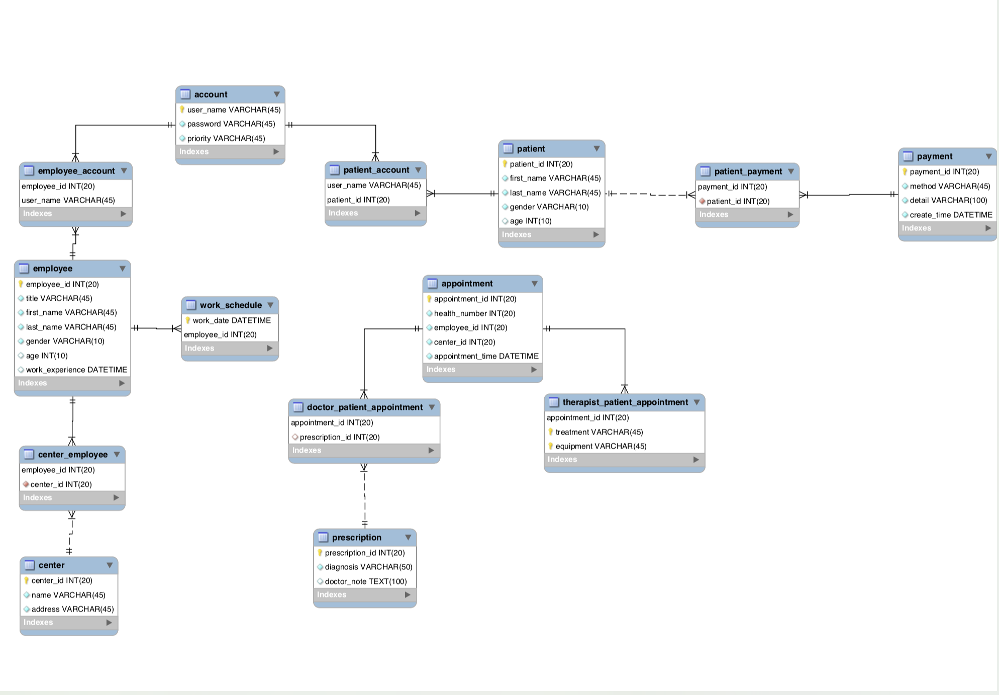

# BSPC_Management_System
Relational database application system for Bahamas Sports Physio Center

## Project Description
### Abstract
- Implement a system to organize the operational management for a hospital.
- Users are able to create/delete/edit/view information through browser according to their own
authorization.

## Tool && FrameWork
- MySQL
- PHP
- HTML
- visual Paradiagm

## Database Design
#### Database Schema
- Registration
- Appointment
- Therapists
- Doctors
- Prescription
- Treatment
- Diagnosis
- Payment

#### Access rights
- Administrator (receptionist/nurse/doctor)
- User(patient)

#### Database E/R diagram

